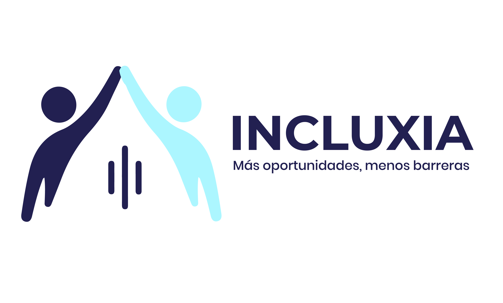

<p align="center">
  
</p>

<h1 align="center">Incluxia</h1>

<p align="center">
  Plataforma laboral boliviana para personas con pérdida auditiva e hipoacusia.<br/>
  Postulaciones y entrevistas <strong>100 % por chat o WhatsApp</strong>, sin llamadas telefónicas.
</p>

<p align="center">
  <a href="https://astro.build"></a>
  <a href="https://gsap.com"></a>
  <a href="https://vercel.com"></a>
</p>

---

## ✨ Características

- **10 rutas** generadas estáticamente (SSG), incluidas vistas de detalle con `[slug]`.
- **4 colecciones de datos** en JSON: artículos, empleos, perfiles y casos de éxito.
- **Sistema de diseño con tokens**: color, tipografía fluida `clamp()` y espaciados centralizados en `src/styles/tokens.css`.
- **Accesibilidad primero**: contraste AA, foco visible, soporte de `prefers-reduced-motion`, navegación por teclado y textos alternativos en todos los recursos.
- **SEO on-page**: meta tags, Open Graph y título/descripción por ruta.
- **Animación** con GSAP y transiciones de vista con `astro:transitions`.
- **Botón flotante de WhatsApp** para postular sin llamadas.

## 🗺️ Rutas

| Ruta | Descripción |
|------|-------------|
| `/` | Inicio: hero, categorías y destacados |
| `/nosotros` | Quiénes somos y misión |
| `/empleos` · `/empleos/[slug]` | Bolsa de empleo y detalle de vacante |
| `/perfiles` · `/perfiles/[slug]` | Perfiles profesionales y detalle |
| `/casos-de-exito` · `/casos-de-exito/[slug]` | Historias de inclusión laboral |
| `/blog` · `/blog/[slug]` | Artículos y guías |

## 🛠️ Stack

| Capa | Tecnología |
|------|-----------|
| Framework | [Astro 7](https://astro.build) — islas + SSG |
| Estilos | CSS puro con custom properties (tokens) |
| Animación | [GSAP 3](https://gsap.com) |
| Tipografía | Montserrat (títulos) · Poppins (cuerpo) |
| Datos | JSON estático en `src/data/` |
| Despliegue | [Vercel](https://vercel.com) (salida estática) |

## 🚀 Inicio rápido

```bash
git clone https://github.com/lexs175/Incluxia.git
cd Incluxia
npm install
npm run dev      # http://localhost:4321
```

| Comando | Descripción |
|---------|-------------|
| `npm run dev` | Servidor de desarrollo |
| `npm run build` | Build de producción en `dist/` |
| `npm run preview` | Vista previa del build |

## 📁 Estructura

```
Incluxia/
├── public/
│   ├── Icon/          # Iconos sociales
│   ├── Logos/         # Variantes de logo
│   └── images/        # Imágenes del sitio
└── src/
    ├── components/
    │   ├── cards/     # BlogCard · JobCard · ProfileCard · StoryCard
    │   ├── layout/    # Header · Footer · WhatsAppFAB
    │   └── ui/        # Button · Badge · ExpandableButton
    ├── data/          # articles · jobs · profiles · stories (.json)
    ├── layouts/       # Layout base (head, SEO, fuentes, GSAP)
    ├── pages/         # Rutas del sitio (SSG)
    └── styles/
        ├── tokens.css # Design tokens (color, tipo, espacio)
        └── global.css # Reset, base y utilidades
```

## 🎨 Sistema de diseño

Toda decisión visual vive en los tokens: los componentes **no** declaran colores ni
tamaños de fuente hardcodeados.

```css
/* src/styles/tokens.css */
--color-primary: #212051;
--color-accent:  #ACF7FF;
--text-hero:     clamp(2.5rem, 1.2rem + 4vw, 4.5rem);
```

Tres reglas de arquitectura que siguen todos los componentes:

1. **Cero hex/rgba quemados** → siempre `var(--color-*)`.
2. **Tipografía fluida** → un solo `font-size` con `clamp()`, sin `font-size`
   dentro de media queries.
3. **Layout en 3 capas** → *wrapper* (`100%`) → `.container`
   (`max-width` + `padding-inline`) → *cápsula* visual (fondo, radio, sombra).

## 📦 Datos

El contenido se edita sin tocar componentes:

| Archivo | Ítems |
|---------|-------|
| `src/data/articles.json` | 7 artículos |
| `src/data/jobs.json` | 4 vacantes |
| `src/data/profiles.json` | 6 perfiles |
| `src/data/stories.json` | 3 casos de éxito |

---

<p align="center">Incluxia Bolivia · Más oportunidades, menos barreras</p>
