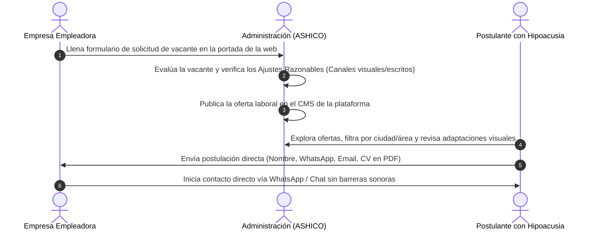

# Informe Académico: Funcionalidad, Arquitectura e Inclusión de la Plataforma Web
## Memoria del Proyecto de Grado (UMSS / ASHICO - Bolivia)

---

## 1. 📋 Resumen Ejecutivo del Sistema

El presente sistema web constituye una **plataforma digital de intermediación laboral inclusiva**, desarrollada en el marco del Proyecto de Grado para responder a las barreras de exclusión y comunicación que enfrentan las personas con discapacidad auditiva (hipoacusia) en Bolivia, en el rango de edad de 25 a 45 años.

La plataforma opera bajo un modelo institucional donde la **marca comercial del portal (IncluyeAudición)** actúa como la herramienta tecnológica de conexión, mientras que la **Asociación de Hipoacúsicos Cochabamba (ASHICO)** ejerce el rol de entidad administradora y patrocinadora, garantizando la validez social, la verificación de ofertas laborales y la observancia del marco legal vigente en el país (**Ley N° 223, Ley N° 977, D.S. 1893 y Ley N° 1658**).

---

## 2. ⚙️ Modelo de Funcionamiento y Roles del Sistema

La arquitectura funcional del sistema se estructura a partir de la interacción coordinada entre tres actores principales:

### 2.1 Rol de la Entidad Administradora (Marca / ASHICO)
- **Recepción y Filtro de Vacantes:** La administración centraliza las solicitudes enviadas por las organizaciones empleadoras a través del formulario integrado en la plataforma.
- **Verificación de Ajustes Razonables:** Antes de hacer pública una oferta laboral, la administración valida que el puesto cuente con adaptaciones de accesibilidad comunicacional (procedimientos de selección por chat o WhatsApp, tareas sin atención telefónica obligatoria e instructivos escritos).
- **Publicación y Gestión del CMS:** Una vez verificada la vacante, ASHICO publica el anuncio en la Bolsa de Empleo del portal para su visibilidad inmediata.

### 2.2 Rol de los Postulantes (Personas con Hipoacusia)
- **Exploración Libre y Accesible:** Los usuarios ingresan a la plataforma sin necesidad de procesos complejos de inicio de sesión o contraseñas, lo que reduce la carga cognitiva y elimina barreras tecnológicas.
- **Identificación de Adaptaciones:** En cada oferta laboral, el postulante visualiza distintivos claros (*Badges de Accesibilidad*) que le garantizan cómo se desarrollará la comunicación dentro de la empresa.
- **Postulación Directa e Inclusiva:** El proceso de candidatura se realiza completando un formulario integrado al final de la oferta laboral (Nombre, WhatsApp, Correo electrónico y archivo CV en formato PDF), o mediante un enlace directo a WhatsApp. Esto elimina de forma definitiva las entrevistas o llamadas sonoras preliminares.

### 2.3 Rol de las Empresas Empleadoras
- **Solicitud de Publicación de Vacantes:** Las empresas interesadas en cumplir con las cuotas de contratación inclusiva en Bolivia utilizan un formulario simplificado de cuatro campos ubicado en la página de inicio.
- **Acompañamiento Institucional:** Las organizaciones reciben orientación sobre cómo implementar ajustes razonables en el entorno de trabajo y acceden a material informativo en la plataforma.

---

## 3. 📚 Justificación Funcional de las Páginas del Portal

### 3.1 Página de Inicio (`Home / /`)
- **Propósito:** Actúa como el centro de bienvenida y aterrizaje (*Landing Hub*). Presenta la propuesta de valor de la plataforma, exhibe las ofertas laborales más recientes con filtros rápidos por ciudad y área, integra el formulario de solicitud para empresas y presenta adelantos del blog e historias de éxito.
- **Justificación:** Garantiza la **Regla de los 3 Clics** y el principio **KISS (Keep It Simple, Stupid)**, permitiendo que tanto el postulante como la empresa encuentren su requerimiento en menos de cinco segundos.

### 3.2 Página de Bolsa de Empleo y Detalle (`/empleos` y `/empleos/:slug`)
- **Propósito:** La página de catálogo (`/empleos`) permite realizar búsquedas avanzadas con un panel lateral de filtros (Ciudad, Área y Tipo de Ajuste). La subpágina de detalle (`/empleos/:slug`) describe las funciones del puesto, los requisitos y la ficha de adaptaciones visuales, albergando el formulario de postulación al final.
- **Justificación:** Elimina la ansiedad provocada por los procesos de selección tradicionales, asegurando que la persona con hipoacusia postule con pleno conocimiento de que no será evaluada por llamadas de voz.

### 3.3 Blog Informativo (`/blog` y `/blog/:slug`)
- **Propósito:** Espacio educativo que alberga artículos clasificados en tres categorías principales: *Salud Auditiva y Grados de Hipoacusia*, *Marco Legal en Bolivia (Ley 223 y Ley 977)* y *Consejos de Comunicación Inclusiva para Reclutadores*. Incorpora reproductores de video con subtítulos e interpretación en **Lengua de Señas Boliviana (LSB)**.
- **Justificación:** Responde a los hallazgos de la investigación de campo, los cuales evidencian que la principal barrera para la inclusión es el desconocimiento y los prejuicios de los empleadores oyentes. El blog educa a la sociedad y difunde la normativa nacional.

### 3.4 Casos de Éxito (`/casos-de-exito` y `/casos-de-exito/:slug`)
- **Propósito:** Galería interactiva que presenta testimonios reales en texto y video (con subtítulos y LSB) de profesionales con hipoacusia desempeñándose exitosamente en empresas bolivianas.
- **Justificación:** Fundamentado en la **Teoría de la Discriminación Estadística** (Phelps, 1972). Al mostrar evidencia tangible de trabajadores productivos en el mercado local, se desarman los estereotipos negativos que asocian la discapacidad auditiva con incapacidad laboral.

### 3.5 Sobre ASHICO y Red de Apoyo (`/nosotros`)
- **Propósito:** Presenta la trayectoria institucional de la Asociación de Hipoacúsicos Cochabamba, ofrece una guía práctica para tramitar el Carnet de Discapacidad (**SIPRUNPCD**) y proporciona canales de contacto directo y ubicación geográfica en el municipio de Cercado.
- **Justificación:** Brinda respaldo institucional, seguridad jurídica y asesoramiento técnico a las personas con hipoacusia que aún no cuentan con su registro oficial de discapacidad.

---

## 4. 🧠 Fundamentación Teórica e Inclusión Accesible

El diseño y funcionamiento del portal se sustentan en tres pilares conceptuales del proyecto de grado:

1. **Modelo Social de la Discapacidad (Oliver, 1990):** La discapacidad no reside en la deficiencia auditiva del individuo, sino en las barreras comunicacionales que impone la sociedad. La plataforma elimina dichas barreras al sustituir los canales auditivos por medios digitales escritos y visuales.
2. **Teoría del Capital Humano (Becker, 1964):** Reconoce que la educación, las competencias técnicas y la atención al detalle de las personas con hipoacusia constituyen un activo altamente productivo para las empresas cuando existen condiciones de accesibilidad.
3. **Pautas de Accesibilidad Web (WCAG 2.2):** La interfaz utiliza una tipografía jerarquizada (**Montserrat** para titulares y **Poppins** para cuerpo de texto), contraste cromático optimizado (Azul primario `#212051` y Acento `#ACF7FF`) y estructura semántica HTML5 sin elementos redundantes ni barreras de navegación.

---

## 5. 📊 Diagrama de Síntesis del Proceso de Intermediación

\[
\text{Proceso de Intermediación} = \text{Oferta Validada por ASHICO} \xrightarrow{\quad\text{Filtro de Ajustes Visuales}\quad} \text{Postulación Accesible por WhatsApp/CV} \xrightarrow{\quad\text{Inserción Laboral Sostenible}\quad}
\]

El sistema garantiza que cada etapa del flujo se desarrolle con **cero fricción sonora**, respetando la dignidad, autonomía y derechos laborales de las personas con discapacidad auditiva en Bolivia.
