# Plan Maestro Definitivo de Arquitectura de la Información
## Proyecto de Grado: Plataforma Web Inclusiva de Empleo (ASHICO - Bolivia)

---

## 📄 ÍNDICE GENERAL DEL DOCUMENTO

1. **Diagnóstico e Investigación en Bolivia (Marco Legal y ASHICO)**
2. **Estrategia de Branding y Roles de Usuario**
3. **Árbol Jerárquico del Sitio (Visual Sitemap Tree)**
4. **Desglose Detallado Sección por Sección (Las 5 Páginas)**
5. **Fundamentación Teórica y Científica (Basado en la Tesis)**
6. **Plan de Verificación y Siguientes Pasos**

---

## 1. 📌 DIAGNÓSTICO E INVESTIGACIÓN EN BOLIVIA

Basado en el estudio realizado con la **Asociación de Hipoacúsicos Cochabamba (ASHICO)** y los datos oficiales del Censo de Población y Vivienda (INE):

- **Población Objetivo:** Jóvenes y adultos de 25 a 45 años con hipoacusia (leve, moderada, severa o profunda) en Bolivia.
- **Problemática Principal:** La causa de la exclusión laboral no es la capacidad del trabajador, sino los procesos de selección inaccesibles (entrevistas por llamada telefónica, videos sin subtítulos, falta de intérpretes de Lengua de Señas Boliviana - LSB) y los prejuicios de los empleadores.
- **Marco Legal Relevante en Bolivia:**
  - **Ley N° 223:** Ley General para Personas con Discapacidad.
  - **Ley N° 977:** Ley de Inserción Laboral y Ayuda Económica.
  - **Decreto Supremo 1893:** Reglamentación de la Lengua de Señas Boliviana (LSB).
  - **Ley N° 1658:** Ley de Derechos de las Personas Sordas en Bolivia.

---

## 2. 🏷️ ESTRATEGIA DE BRANDING Y ROLES DE USUARIO

- **Marca Comercial de la Plataforma:** *"IncluyeAudición Bolivia"* (o el nombre elegido para la herramienta).
- **Entidad Administradora y Patrocinadora:** *"Una iniciativa administrada y respaldada por la Asociación de Hipoacúsicos Cochabamba (ASHICO)"*.

### Flujo Real de Usuarios:
1. **Postulante con Hipoacusia:** Navega las ofertas, filtra por ciudad/área, lee los ajustes de accesibilidad visual y postula directamente al final de la página de detalle llenando su Nombre, WhatsApp, Correo y CV (PDF) sin llamadas telefónicas.
2. **Empresas Empleadoras:** Completa un formulario sencillo de 4 campos en la portada (Home) para solicitar la publicación de una vacante.
3. **Administración (ASHICO):** Revisa las solicitudes de las empresas y publica las vacantes en la plataforma.

---

## 3. 🌳 ÁRBOL JERÁRQUICO DEL SITIO (VISUAL SITEMAP TREE)

```mermaid
graph TD
    classDef header fill:#1e293b,stroke:#0f172a,color:#ffffff,stroke-width:2px;
    classDef page fill:#2563eb,stroke:#1d4ed8,color:#ffffff,stroke-width:2px;
    classDef subpage fill:#0284c7,stroke:#0369a1,color:#ffffff,stroke-width:1px;
    classDef section fill:#f8fafc,stroke:#cbd5e1,color:#0f172a,stroke-width:1px;
    classDef form fill:#10b981,stroke:#047857,color:#ffffff,stroke-width:2px;

    HEADER["🌐 HEADER / MENÚ PRINCIPAL NAVEGACIÓN<br/>(Logo Plataforma + Respaldo ASHICO)"]:::header

    HEADER --> P1["1. INICIO / HOME<br/>(/)"]:::page
    HEADER --> P2["2. OFERTAS DE EMPLEO<br/>(/empleos)"]:::page
    HEADER --> P3["3. BLOG INFORMATIVO<br/>(/blog)"]:::page
    HEADER --> P4["4. CASOS DE ÉXITO<br/>(/casos-de-exito)"]:::page
    HEADER --> P5["5. SOBRE ASHICO<br/>(/nosotros)"]:::page

    %% PÁGINA 1
    P1 --> P1_S1["Hero Bienvenida & Propuesta de Valor"]:::section
    P1 --> P1_S2["Lista de Ofertas Destacadas con Filtro Rápido"]:::section
    P1 --> P1_S3["Formulario para Empresas (Publicar Vacante)"]:::form
    P1 --> P1_S4["Carrusel de Empresas Aliadas en Bolivia"]:::section
    P1 --> P1_S5["Adelanto: Casos de Éxito"]:::section
    P1 --> P1_S6["Adelanto: Artículos del Blog"]:::section
    P1 --> P1_S7["Footer (Contactos & Leyes)"]:::section

    %% PÁGINA 2
    P2 --> P2_SUB["📄 SUBPÁGINA: Detalle de Oferta<br/>(/empleos/:slug)"]:::subpage
    P2_SUB --> P2_S1["Cabecera del Puesto, Empresa y Ciudad"]:::section
    P2_SUB --> P2_S2["Ficha de Ajustes Razonables (Canales Visuales)"]:::section
    P2_SUB --> P2_S3["Descripción de Tareas y Requisitos"]:::section
    P2_SUB --> P2_S4["Formulario de Postulación (Nombre, WhatsApp, CV)"]:::form

    %% PÁGINA 3
    P3 --> P3_S1["Buscador & Filtros por Categorías"]:::section
    P3_S1 --> P3_CAT1["Cat 1: Salud Auditiva & Grados"]:::section
    P3_S1 --> P3_CAT2["Cat 2: Leyes Bolivia (Ley 223 / 977)"]:::section
    P3_S1 --> P3_CAT3["Cat 3: Consejos para Empresas"]:::section
    P3 --> P3_SUB["📄 SUBPÁGINA: Detalle de Artículo<br/>(/blog/:slug)"]:::subpage
    P3_SUB --> P3_DET1["Lectura Completa del Artículo + Videos LSB / Subtítulos"]:::section

    %% PÁGINA 4
    P4 --> P4_S1["Galería de Testimonios y Profesionales"]:::section
    P4 --> P4_SUB["📄 SUBPÁGINA: Detalle de Historia<br/>(/casos-de-exito/:slug)"]:::subpage
    P4_SUB --> P4_DET1["Entrevista Completa + Video con Intérprete LSB"]:::section

    %% PÁGINA 5
    P5 --> P5_S1["Misión, Visión e Historia de ASHICO Cochabamba"]:::section
    P5 --> P5_S2["Guía de Trámites (Carnet SIPRUNPCD & Ley 977)"]:::section
    P5 --> P5_S3["Formulario de Contacto & Ubicación en Cercado"]:::section
```

---

## 4. 📐 DESGLOSE DETALLADO SECCIÓN POR SECCIÓN

### 🟢 PÁGINA 1: Inicio / Home (`/`)
- **Sección 1 (Header):** Logo de la Plataforma + Sello *"Respaldo ASHICO"* + Menú (`Inicio`, `Ofertas`, `Blog`, `Casos de Éxito`, `Nosotros`).
- **Sección 2 (Hero):** Título principal + Subtítulo inspirador + Botón *"Ver Ofertas"* + Botón *"Publicar Vacante"*.
- **Sección 3 (Bolsa de Empleo Destacada):** Filtro directo por Ciudad y Área laboral + Grilla de tarjetas de empleo con etiqueta de accesibilidad (ej: *Contacto 100% por WhatsApp*) + Botón *"Ver Oferta"*.
- **Sección 4 (Formulario para Empresas):** Formulario de 4 campos integrado (*Nombre de empresa, Nombre de contacto, WhatsApp/Correo, Puesto y requisitos*) + Botón *"Enviar Solicitud"*.
- **Sección 5 (Carrusel de Empresas Aliadas):** Franja con logos de empresas e instituciones comprometidas en Bolivia.
- **Sección 6 (Adelanto Casos de Éxito):** Muestra de 2 o 3 historias inspiradoras + Botón *"Ver todos los Casos de Éxito →"*.
- **Sección 7 (Adelanto del Blog):** Muestra de 2 o 3 notas sobre leyes y salud auditiva + Botón *"Ir al Blog →"*.
- **Sección 8 (Footer):** Contacto de ASHICO Cochabamba, dirección en Cercado, WhatsApp y leyes (Ley 223/977).

---

### 🔵 PÁGINA 2: Detalle de Oferta Laboral (`/empleos/:slug`)
- **Sección 1 (Cabecera):** Título del puesto, Nombre de la Empresa, Ciudad y Modalidad (Presencial / Remoto).
- **Sección 2 (Ficha de Ajustes Razonables):** Iconos claros (💬 *Entrevistas por WhatsApp*, 🎧 *Puesto sin llamadas*, 📄 *Instrucciones escritas*).
- **Sección 3 (Detalles):** Descripción de funciones y requisitos técnicos del puesto.
- **Sección 4 (Formulario de Postulación Embebido):** Formulario al final de la página (Nombre, WhatsApp, Email, Adjuntar CV en PDF + Botón *"Enviar Postulación"*).

---

### 🟣 PÁGINA 3: Blog Informativo (`/blog`)
- **Sección 1 (Portada & Buscador):** Título del blog y barra para buscar artículos por palabra clave.
- **Sección 2 (Categorías):** Filtros (`Todos`, `Salud Auditiva`, `Leyes en Bolivia`, `Consejos para Empresas`).
- **Sección 3 (Lista de Notas & Detalle `/blog/:slug`):** Tarjetas con foto, título, resumen y lectura completa con videos subtitulados/LSB.

---

### 🟡 PÁGINA 4: Casos de Éxito (`/casos-de-exito`)
- **Sección 1 (Portada):** Título de impacto sobre inclusión laboral en Bolivia.
- **Sección 2 (Galería de Testimonios & Detalle `/casos-de-exito/:slug`):** Tarjetas grandes con foto, profesión, empresa en Bolivia y video con **Subtítulos + Intérprete LSB**.

---

### 🔴 PÁGINA 5: Sobre ASHICO (`/nosotros`)
- **Sección 1 (¿Quiénes Somos?):** Historia y labor de la Asociación de Hipoacúsicos Cochabamba (ASHICO) como administradora de la plataforma.
- **Sección 2 (Guía de Trámites):** Pasos para obtener el Carnet de Discapacidad (SIPRUNPCD) y resumen de la Ley N° 977.
- **Sección 3 (Contacto & Mapa):** Formulario de consulta, dirección física en Cochabamba y WhatsApp.

---

## 5. 🧠 FUNDAMENTACIÓN TEÓRICA Y CIENTÍFICA (TESIS UMSS)

- **Modelo Social de la Discapacidad (Oliver, 1990):** Sustenta que la discapacidad no es la falta de audición, sino la barrera del entorno. La plataforma elimina la barrera sonora en los procesos de postulación.
- **Teoría del Capital Humano (Becker, 1964):** Resalta las competencias y productividad de las personas con hipoacusia cuando cuentan con adaptaciones razonables.
- **Teoría de la Discriminación Estadística (Phelps, 1972 / Arrow, 1973):** Explica cómo los empleadores descartan postulantes por estereotipos. Los casos de éxito y la guía para empresas rompen estos prejuicios.
- **Accesibilidad Web WCAG 2.2:** La web está diseñada con diseño tipográfico amplio, contrastes legibles nativos y formulación por texto para cero fricción.

---

## 6. 🚀 PLAN DE VERIFICACIÓN Y SIGUIENTES PASOS

1. **Aprobación del Plan Maestro:** Validar la estructura del plan.
2. **Prototipado en Framer:** Creación de las páginas, componentes visuales y CMS de vacantes/blog.
3. **Publicación y Pruebas:** Despliegue en vivo para evaluación con usuarios y presentación del Proyecto de Grado.
